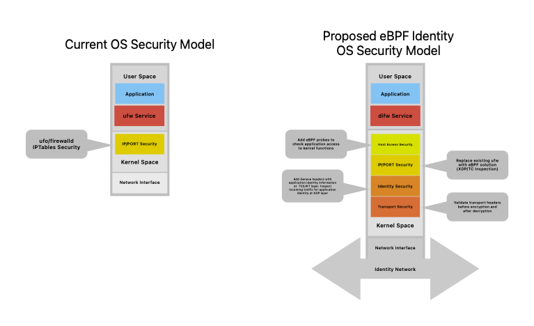
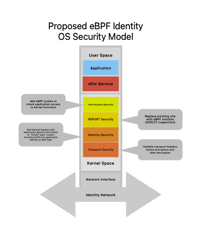
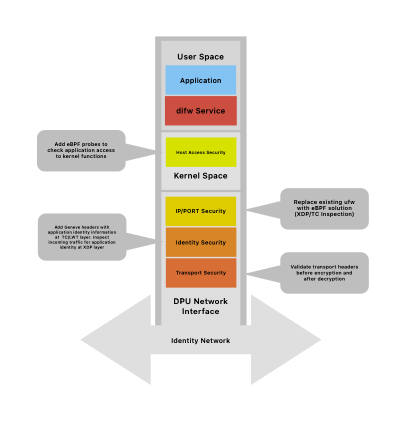

# Overview

Being "Gloriously Unemployed" I have the luxury of time to think and say things that might not fly in a corporate environment for many reasons. One of the areas I have been thinking about is how to both improve and simplify security for data centers and edge deployments. To be clear I am not proposing replacing all of the existing security infrastructure as much of it does a great job currently, however I think public/private clouds and edge deployments are still too complex and underserved.

My proposal is fairly radical as it moves a lot of the responsibility for the security framework from security vendors to the OS vendors such as Redhat, Ubuntu and Microsoft. This then implies that there are opportunities for public clouds vendors such as AWS, Azure and GCP, and private cloud vendors such as Dell, HPE, Supermicro to offer easier to deploy and better security services to their customers.

Current approaches for securing application traffic and application behavior are complex to deploy and manage. They are user space applications running on centralized modes that all traffic must traverse or some combination of user space agents. These approaches are all based on adding security services to the existing infrastructure as user space applications. What is proposed here is to bake security into the OS infrastructure to simplify the deployment and improve the security of the overall system by having context and identity as close as possible to the security infrastructure.

Today infrastructure providers, OS vendors and public cloud vendors draw a very clear line between OS security and application security. This has made sense in the past as the OS Kernel was not something that could be easily modified. However eBPF has changed this dramatically, both for Linux and Windows. Now there are several entry points in the kernel for dynamically loaded code to be safely inserted. These entry points can be used to insert security into the kernel allowing security to be both distributed independent of the application level and to be managed easily, i.e. it can be installed as part of the OS. The vision is to replace ufw/firewalld daemons with a distributed identity firewall (difw) that in the default mode provides the same behavior as the existing firewalls but through leveraging eBPF  significantly more security can be added on demand, with no changes to applications or networking infrastructure.

# Approach

Until eBPF to make changes to the kernel was a long process, eBPF has revolutionized the ability to safely insert code into the kernel at runtime at several points. eBPF is now at a point where it has a very rich set of features and more are being added with each kernel release. See: BPF Features by Linux Kernel Version

Some of the key use cases for eBPF map well into the proposed solution:

Observability:  eBPF provides the ability to see deeply into application behavior and communicate it to other parts of the eBPF system.

Networking: The ability to add information from observability to application networking enables a more distributed security model where end points can get information on who and what are trying to communicate with them and more of why.

Security: Based the above information traffic can be allowed, denied, isolated and even dispatched to other security services for deeper inspection.

There are already several individual approaches to using eBPF to provide parts of the security stack. These and other efforts are showing the way forward to create a new way of doing security that is inherent to the operating system, not something bolted onto the side of the operating system.

Examples of existing efforts to leverage eBPF for security:

**Falco:** Cloud Native Runtime Security

**Tetragon:** eBPF-based Security Observability and Runtime Enforcement from Cilium

**OpenZiti:** Edge eBPF firewall/networking framework

And I am sure there are many other examples that others can point out …

However they are all working independently and working on different deployment areas, containers, VMs, bare metal. What I believe that security teams need is a single unified framework that can work on any deployment model and provide the ability to insert security modules that provide the required level of security. In addition they do not communicate, one of the big features of eBPF is shared map structures. Having all the modules communicate context information enables much stronger security and visibility.

The goal then is to push security into the kernel/network infrastructure, replace ufw/firewalld with a flexible security framework that provides current capabilities as the default but enables much more detailed distributed security, provided through a DIFW (Distributed Identity Firewall) as the default security service for Linux deployments be they containers, VMs or bare metal. The operating system should ship with a framework to build upon to increase the security of Linux applications (and Windows too ). With the framework in place more focus can be placed on implementing and deploying security services rather than deploying, scaling and managing centralized security services.

# Initial eBPF Modules

The diagram below shows a proposed model for DIFW security, with some discussion of each of the proposed modules. It is fairly brief as each module requires a complete discussion and what information it would share to improve the security context. It is assumed that all these modules can be turned on and off and loaded/updated dynamically.

In addition relevant data can be shared to LLM/ML systems to provide AI based security. This model works well as there will be a significant amount of data in a common format that machine learning can take advantage of. I believe this is an opportunity for providers of private and public cloud infrastructure to deliver unique value.

Maximize image
Edit image
Delete image

## Host Access Security

Add eBPF probes to check application access to kernel functions, this is similar to what both Falco and Tetragon are doing. They provide information if an application/process has been comprised and is accessing kernel functions or resources  that it is  not permitted to.

The behavior profile of the application is a factor. If the application starts to make a pattern of system calls that are unexpected or not allowed then deeper inspection is warranted, as this is local to the application the inspection is very targeted, and enables swift detection of anomalous applications.

## IP/Port Security

Replace existing ufw with eBPF solution (XDP/TC Inspection). This has already been discussed in several places and numbers show that an eBPF solution would be faster and have a lower resource usage. See: iptables vs. GoXDP: The Ultimate Packet Filtering Benchmark Setup and Results

## Identity Security

This is a newer concept and leverages ideas from Cisco TrustSec. and some work I did in a past life. eBPF makes it easy to add/remove/modify network headers in-line on traffic entering or leaving an application. The suggestion is that we define a new secure identity/context header for Geneve and use it to convey information such as the identity of who owns the application, application signature and other information that the receiver can make use of and apply to their security profile. 

Geneve headers with application identity information can be added at  the TC/LWT layer. Incoming traffic can be inspected for application identity at the  XDP layer, if the packet does not have an identity header it can simply be marked as unknown identity.

Adding headers does run into MTU issues but as more of the public clouds move to a default Jumbo Frame and eBPF allows inserting before packets a defined this should not be a major issue but does need worked through.

This area needs a lot of work and prototyping but if the operating system can communicate with other nodes and provide more context and identity for requests I believe security will be significantly improved. 

## Transport Security

eBPF can easily inspect application protocols at various levels and validate, except when the transport is TLS enabled. When this is the case eBPF can access the packets either before encryption or after decryption. This is a little more sensitive as it may violate some security principles. The advantage is that it is much more efficient than sending the traffic to a central application to decrypt and encrypt, then inspect and send back.

## Shared Security Information

One of the key advantages of eBPF is the ability to share data through the use of various eBPF Maps. In this way all of the above modules can collaborate  by providing security information to reach actionable decisions. 

This approach also provides the ability to have single security data collection infrastructure that both public and private cloud vendors could use to provide AI/ML security solutions. AI/ML requires large amounts of data, the more consistent the better using this approach public cloud vendors could provide unique services to their customers. Private cloud vendors could also, for example HPE/Juniper offering difw powered versions of Mist AI.

# Key Advantages

So why do this - what does this bring that other approaches do not.

## Improved Security

Security is deployed as part of the kernel, with the OS so no additional requirements for traffic steering or user space agents. Security is deployed with the operating system, making security deployed the default case.

Security is co-resident with applications giving more context, identity information to the security system both locally and remotely.

Easier to deploy and manage, does not require complex load balancing and traffic managment.

Deployable to any sized application host, low overhead means that security can be inserted anywhere. This is critical for small edge deployments where resources are limited, for example enterprise 5G deployments, point of sale systems and other branch devices.

With security embedded with the application host scaling is part of the application infrastructure

In line inspection of traffic and operations lowers overhead as eBPF security is adding a small overhead to already existing applications, when compared to the centralized model or agent models where all processing is new including moving the traffic into  and out of user space.  Cilium/Tetragon has shown that Tetragon adds  ~2% overhead to the system, see: Tetragon 1.0: Kubernetes Security Observability & Runtime Enforcement with eBPF. In addition traffic can be offloaded much earlier, for example dropped packets can be dropped at the XDP layer before they even enter the kernel and user space.

## Complexity Reduction

Scaling is now the responsibility of the application, no need to scale security infrastructure  it is part of the kernel.

No need to implement HA for security services as the security is part of the kernel

Security can be customized and localized to specific applications and locations.

Can still send suspicious traffic to security devices if required.

Does not require changes to applications - security can be integrated into existing hosts with minimal overhead, a few percentage of the CPU load.

Can tailor a specific security profile based on identity, applications, location etc. This can provide a more complete security profile based on the application usage.  Security policies (and visibility) are now applied to the whole distributed application not just pieces.

# Challenges

I will freely admit there are a lot of open issues and potential challenges with this approach but I think that the potential advantages makes it a worthwhile discussion and especially as a lot of work is already being done to implement parts of the solution. The existing work is providing a lot of proof points that reduce the risk.

 Most traffic is encrypted with TLS

End points do the encryption so it is possible to inspect traffic before encryption or after decryption, also as the “identity” of the application traffic is known a decision can be made on the degree to trust the identity provides to determine if the application traffic needs to be inspected. 

Creating a single security framework

This is more a political issue, in that how to get all the players to agree on a common framework to build on. 

Security of eBPF

This is an issue that needs to be addressed regardless as eBPF is more widely deployed and is both a technical issue and an education issue around the usage of eBPF.

Managing the eBPF modules

There is ongoing work be Redhat to enable the better management of eBPF modules within Linux see: bpfman. A solution such as this would require a standard and simple way to load/unload eBPF modules. 

Windows support for eBPF

This is underway but is not as far along as Linux eBPF. For widespread adoption Windows and Linux should be able to over the same capabilities.

Security controller implementation

One topic not touched on here is the need for a controller to coordinate and manage all the difw instances. I dodge this bullet by assuming it is an opportunity for the public/private cloud vendors to provide.

# An Alternative Approach: Leveraging DPUs

eBPF is not the only way to address this problem. I have done a lot of work with DPUs and see them as another way to solve the problem. I think of them as an and rather than an or. It would be easier if the technology stacks around P4, eBPF, SONIC, DASH, etc were more aligned but that is another can or worms.

An alternative way to approach this is to move most of the security stack to a DPU such as Nvidia/Bluefield-3 or AMD/Pensando who have already done some work see: Building DPU Applications to move the security stack to the network. 

Going to a DPU approach is equally valid but has different use cases and different price points and the built in hardware acceleration is useful in higher performance use cases.

# Path Forward

I know this is a very aspirational POV, but the advent of eBPF and also DPUs have opened up new opportunities to simplify and improve security in several ways. Therefore I believe that the opportunities should at a minimum be discussed and if possible prototyped and then discussed more.

What I have proposed is a strawman and should be considered a starting point not the destination and I am sure others will see better paths and solutions. In addition not all the technology pieces are in place just yet, so in some ways this article is a call to action to identify the gaps and work to fill them.

#eBPF #Redhat #Ubuntu #security #Dell #HPE #Supermicro #aws #azure #gcp #DPU #Nvidia #Pensando #5G

